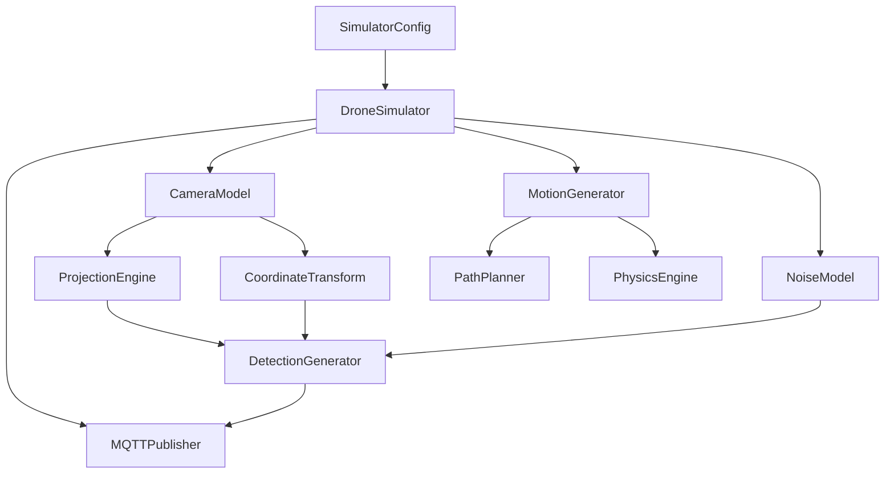

# Design Document

## Overview

The drone detection simulator is a Python application that generates realistic camera-based drone detections using proper geometric calculations and publishes them via MQTT. The system simulates a fixed camera observing drones moving through its field of view, computing accurate world positions from pixel measurements using pinhole camera projection and coordinate transformations.

The simulator consists of several key components: configuration management, geometric calculations (camera projection and coordinate transforms), motion simulation, noise modeling, and MQTT publishing. The design emphasizes modularity, testability, and mathematical accuracy.

## Architecture

### High-Level Components



### Data Flow

1. **Configuration Phase**: Load camera parameters, drone properties, and simulation settings
2. **Initialization Phase**: Compute focal length, setup coordinate transforms, generate flight paths
3. **Simulation Loop**: For each frame:
   - Update drone positions using physics-based motion
   - Project world positions to camera coordinates
   - Generate pixel detections with realistic noise
   - Compute world position estimates from noisy measurements
   - Build JSON detection messages
   - Publish via MQTT with simulated latency

## Components and Interfaces

### SimulatorConfig

A dataclass containing simulation parameters focused on Pi-realistic functionality:

```python
@dataclass
class SimulatorConfig:
    # Camera intrinsics (Pi config values)
    image_width_px: int = 1920
    image_height_px: int = 1080
    focal_length_mm: Optional[float] = None
    sensor_height_mm: Optional[float] = None
    vertical_fov_deg: Optional[float] = 50.0
    principal_point_px: Optional[Tuple[float, float]] = None  # Defaults to center
    
    # Camera extrinsics & geodetics (Pi install config)
    camera_lat_deg: float = 13.736717
    camera_lon_deg: float = 100.523186
    camera_alt_m: float = 1.5
    camera_yaw_deg: float = 90.0  # Simplified: no roll for Pi mount
    camera_pitch_deg: float = 10.0
    
    # Simulation parameters (for generating realistic pixel motion)
    drone_size_m: float = 0.25  # Used internally for projection
    num_drones: int = 1
    path_altitude_agl_m: float = 5.5
    path_span_m: float = 40.0
    speed_mps: float = 5.0
    max_lateral_accel_mps2: float = 1.5
    
    # Timing
    duration_s: float = 12.0
    fps: float = 15.0
    
    # Pi-level noise (detector realism)
    pixel_centroid_sigma_px: float = 1.0
    bbox_size_sigma_px: float = 2.0
    confidence_noise: float = 0.05
    miss_rate_small: float = 0.03
    false_positive_rate: float = 0.01
    processing_latency_ms_mean: float = 50.0
    processing_latency_ms_jitter: float = 20.0
    
    # MQTT settings
    mqtt_host: str = "localhost"
    mqtt_port: int = 1883
    mqtt_topic: str = "sensors/cam01/detections"
    mqtt_qos: int = 0
    retain: bool = False
    client_id: str = ""
    
    # Testing options
    deterministic_seed: Optional[int] = None
    offline_mode: bool = False  # Print JSON instead of MQTT
```

### CameraModel

Handles basic camera parameters and projection to pixels (Pi-level functionality):

```python
class CameraModel:
    def __init__(self, config: SimulatorConfig):
        self.config = config
        self.focal_px = self._compute_focal_px()
        self.principal_point = self._get_principal_point()
    
    def _compute_focal_px(self) -> float:
        """Compute focal length in pixels from config parameters"""
    
    def _get_principal_point(self) -> Tuple[float, float]:
        """Get principal point, defaulting to image center"""
    
    def project_world_to_pixels(self, world_pos_enu: np.ndarray) -> Dict:
        """Project world position to pixel coordinates (for simulation only)"""
    
    def get_camera_metadata(self) -> Dict:
        """Return fixed camera metadata for JSON payload"""
```

### MotionGenerator

Generates realistic drone flight paths:

```python
class MotionGenerator:
    def __init__(self, config: SimulatorConfig):
        self.config = config
        self.paths = self._generate_drone_paths()
    
    def _generate_drone_paths(self) -> List[List[np.ndarray]]:
        """Generate smooth ENU paths for all drones"""
    
    def get_positions_at_time(self, time_s: float) -> List[np.ndarray]:
        """Get current ENU positions for all drones at given time"""
    
    def _apply_physics_constraints(self, positions: List[np.ndarray]) -> List[np.ndarray]:
        """Ensure motion respects acceleration limits"""
```

### NoiseModel

Applies realistic detection noise:

```python
class NoiseModel:
    def __init__(self, config: SimulatorConfig, rng: np.random.Generator):
        self.config = config
        self.rng = rng
    
    def apply_detection_noise(self, clean_detection: Dict) -> Dict:
        """Add pixel noise and recompute distance from noisy measurements"""
    
    def should_miss_detection(self, detection: Dict) -> bool:
        """Determine if detection should be missed based on size/distance"""
    
    def generate_false_positive(self) -> Optional[Dict]:
        """Generate false positive detection if probability triggers"""
```

### MQTTPublisher

Handles message publishing:

```python
class MQTTPublisher:
    def __init__(self, config: SimulatorConfig):
        self.config = config
        self.client = self._setup_mqtt_client()
    
    def publish_detection(self, detection_json: Dict) -> bool:
        """Publish detection with simulated latency and packet drops"""
    
    def _simulate_network_effects(self) -> Tuple[float, bool]:
        """Return (latency_ms, should_drop_packet)"""
```

## Data Models

### Detection Message Schema (Pi-Realistic)

The JSON detection message mimics what a real Pi-based camera would send - pixel detections with basic camera metadata, no heavy 3D computations:

```json
{
  "timestamp_utc": "2025-09-21T08:23:12.123Z",
  "frame_id": 12345,
  "camera": {
    "resolution": [1920, 1080],
    "focal_px": 900.0,
    "principal_point": [960.0, 540.0],
    "yaw_deg": 90.0,
    "pitch_deg": 10.0,
    "lat_deg": 13.736717,
    "lon_deg": 100.523186,
    "alt_m_msl": 1.50
  },
  "detections": [
    {
      "class": "drone",
      "confidence": 0.91,
      "bbox_px": [980, 520, 1020, 580],
      "center_px": [1000, 550],
      "size_px": [40, 60]
    }
  ],
  "edge": {
    "processing_latency_ms": 42,
    "detector_version": "det-v1.2"
  }
}
```

### Responsibility Split

**Pi/Simulator Outputs:**
- Pixel-space detections (bbox_px, center_px, size_px, confidence)
- Fixed camera metadata (resolution, focal_px, principal_point, pose, geodetic position)
- Light edge metadata (processing_latency_ms, detector_version)

**Backend Responsibilities (not in simulator):**
- Distance estimation from pixel size
- 3D coordinate transformations (camera → world → geodetic)
- ENU/WGS84 conversions and altitude AGL calculations
- Complex tracking and filtering
- Network jitter modeling (transport-level, not payload-level)

### Coordinate Systems

1. **Camera Frame**: +Z forward (optical axis), +X right, +Y down
2. **ENU World Frame**: +X east, +Y north, +Z up (relative to camera origin)
3. **Geodetic Frame**: WGS84 latitude/longitude/altitude MSL

## Error Handling

### Configuration Validation

- Validate mutually exclusive focal length specifications
- Check for reasonable parameter ranges (FOV 1-179°, positive distances)
- Ensure MQTT connection parameters are valid

### Runtime Error Handling

- Graceful MQTT connection failures with retry logic
- Handle coordinate transformation edge cases (points behind camera)
- Manage bounding box clipping at image boundaries
- Validate detection measurements before publishing

### Logging Strategy

- Use Python logging module with configurable levels
- Log configuration validation results
- Track MQTT connection status and publish failures
- Record detection statistics (miss rates, false positives)

## Testing Strategy

### Unit Tests

- **Geometric Functions**: Test focal length computation, coordinate transforms, projection accuracy
- **Motion Generation**: Verify smooth paths, acceleration constraints, timing accuracy
- **Noise Models**: Test statistical properties of noise application
- **JSON Generation**: Validate message schema compliance

### Integration Tests

- **End-to-End Simulation**: Run complete simulation cycle and validate output
- **MQTT Integration**: Test publishing with mock broker
- **Configuration Loading**: Test various config combinations

### Validation Tests

- **Geometric Accuracy**: Compare projections with known ground truth
- **Motion Realism**: Verify acceleration limits and smooth trajectories
- **Deterministic Behavior**: Test reproducibility with fixed random seeds

### Performance Tests

- **Frame Rate**: Ensure real-time performance at target FPS
- **Memory Usage**: Monitor memory consumption during long simulations
- **MQTT Throughput**: Test publishing performance under load

## Implementation Notes

### Pi-Realistic Approach

- Focus on what a Pi camera would actually compute: pixel detections + fixed metadata
- Use world-to-pixel projection internally for simulation, but don't expose 3D calculations in output
- Keep processing lightweight to match Pi computational constraints
- Simulate detector behavior (confidence, noise, misses) rather than perfect geometric calculations

### Modularity Design

- Separate simulation logic (world motion) from Pi output (pixel detections)
- Keep camera metadata as simple constants (install configuration)
- Use pure functions for pixel projection and noise application
- Isolate MQTT publishing for easy testing

### Performance Considerations

- Pre-compute camera focal length and principal point
- Use simple 2D projection math (avoid heavy 3D transforms in output path)
- Generate smooth pixel-space motion to match realistic detector behavior
- Minimize per-frame computation to match Pi processing capabilities